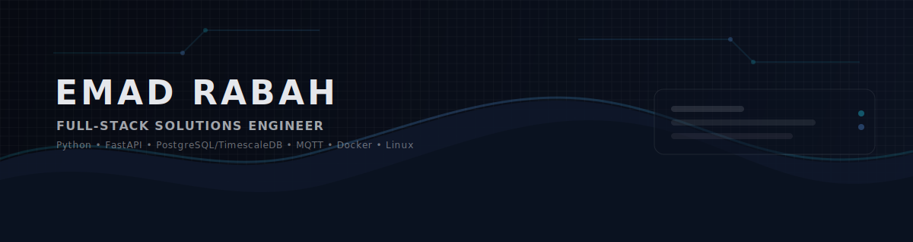

  

Full-Stack Solutions Engineer focused on building systems that work reliably in real-world environments.

Experience spans scalable backend platforms, industrial monitoring systems, and modern web & mobile applications. Work ranges from low-level device communication and telemetry ingestion to cloud-based dashboards, APIs, and production-ready Flutter applications powered by Firebase.

Strong emphasis on clean architecture, long-term maintainability, and practical engineering decisions - whether the system runs on an edge gateway, a Linux server, or inside a mobile application used daily by real users.

---

### Areas of Expertise
- Scalable backend systems (Python, FastAPI)
- Industrial telemetry & edge gateways (RS-485, Modbus, MQTT)
- High-volume ingestion pipelines & time-series data
- Web applications (TypeScript, modern frontend stacks)
- Cross-platform mobile development with **Flutter**
- Cloud-native solutions using **Firebase**
- Authentication & identity systems (SSO, SAML)
- Dockerized deployments & Linux-based infrastructure

---

### Selected Systems

#### Campion CathView System
An end-to-end industrial monitoring platform built for reliability and scalability.

The system is structured with clear boundaries between edge data collection, ingestion, and visualization layers — allowing support for thousands of devices while remaining maintainable and secure.

**Core Components**
- **CathView Gateway**  
  Edge service communicating with industrial devices over Modbus/RS-485, validating telemetry, buffering data safely, and publishing securely upstream.

- **CathView Ingest**  
  A scalable ingestion layer receiving telemetry over MQTT, processing and validating messages, and persisting time-series data efficiently into PostgreSQL/TimescaleDB.

- **CathView Web**  
  A web application providing dashboards, device visibility, monitoring tools, and system administration capabilities.

---

### Other Work & Applications

Beyond industrial systems, additional work includes production-ready applications built with Flutter and Firebase:

- Cross-platform mobile applications
- Real-time dashboards
- Equipment and asset management systems
- Delivery and operational management platforms
- Backend APIs connected to Firebase and custom infrastructure

---

### Technology Stack
- **Languages:** Python, TypeScript, Dart  
- **Backend:** FastAPI, REST APIs  
- **Mobile:** Flutter  
- **Cloud:** Firebase  
- **Data:** PostgreSQL, TimescaleDB  
- **Messaging:** MQTT  
- **Frontend:** Modern web stack (Vite, TypeScript)  
- **Infrastructure:** Docker, Linux (Ubuntu Server)  

---

### Professional Approach
Focus on building systems that are clear, scalable, and production-ready. Preference for well-defined boundaries, strong data models, and architecture designed for long-term growth rather than short-term fixes.

---

### Links
- Portfolio: https://emadrabah.com  
- GitHub: https://github.com/emadrabah  
